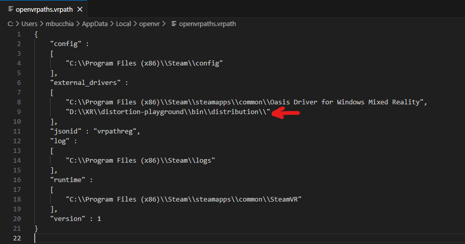
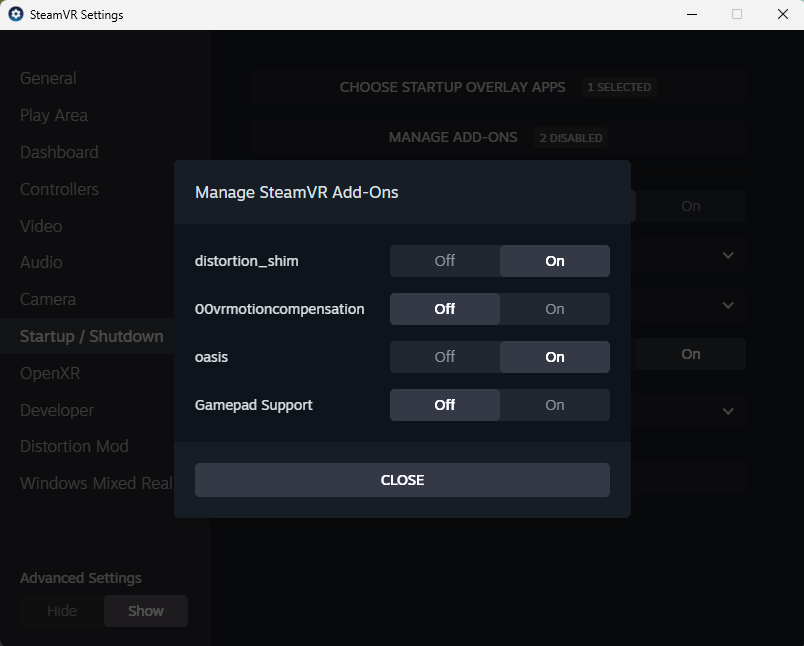
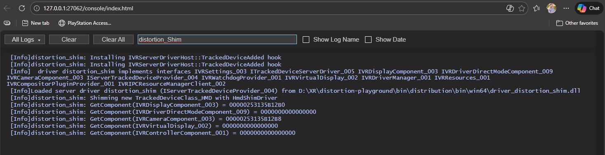

# A playground for SteamVR drivers/compositor experiments

This program shows how to shim (extend) and existing, pre-compiled, SteamVR native display driver in order to change lens distortion profile.

DISCLAIMER: This software is distributed as-is, without any warranties or conditions of any kind. Use at your own risks.

# Developer Walkthrough

## Building and running

1) Make sure to check out all the submodules:

```
git submodule update --init
```

2) Open the VS solution and build the configuration of your choice. The output is placed under `bin/distribution` and matches the file layout expected by SteamVR.

3) **Make sure SteamVR is completely closed.** Then, from the `bin/distribution` folder, run `Register-Driver.bat` to register your driver with SteamVR.

## Driver Shimming with SteamVR

The driver shimming technique allows you to extend or modify the behavior or a driver without recompiling or altering the driver. If you are a driver developer and develop you own driver, you do not need this. This technique is helpful for driver "modders". This technique has been demonstrated in complex drivers, such as the [Virtual Desktop](https://www.vrdesktop.net/) driver for hand and full body tracking.

In order to shim an existing driver, we create our own driver, with its own `HmdDriverFactory()` entry point returning an `IServerTrackedDeviceProvider` class instance. This driver will register a hook that intercepts creation of the driver we are shimming.

Our shim driver must be loaded early, which can be accomplished by providing a `defaults.vrsettings` file that sets the loading priority to a high value:

```json
{
  "driver_distortion_shim": {
    "loadPriority": 1000
  }
}
```

Next, in our driver's activation function, `IServerTrackedDeviceProvider::Init()`, we can optionally determine whether we should attempt shimming (for example, we can detect whether the devices we care about are connected). This step ensures that we don't unnecessarily load our driver:

```cpp
    vr::EVRInitError Init(vr::IVRDriverContext* pDriverContext) override {
        VR_INIT_SERVER_DRIVER_CONTEXT(pDriverContext);

        // Detect whether we should attempt to shim the target driver.
        if (!m_isLoaded) {
            bool loadDriver = false;
            try {
                // FIXME: Do our checks here.
                loadDriver = true;
            } catch (...) {
            }

            if (loadDriver) {
                DriverLog("Installing IVRServerDriverHost::TrackedDeviceAdded hook");
                InstallShimDriverHook(/* Pass useful parameters here */);
                m_isLoaded = true;
            }
        }

        return m_isLoaded ? vr::VRInitError_None : vr::VRInitError_Init_HmdNotFound;
    }
```

The `InstallShimDriverHook()` implementation shows how to install a hook for the `IVRServerDriverHost::TrackedDeviceAdded()` method. This method is the entry point for drivers to register an HMD, controller or tracker device. This is where we will inject ourselves. The current implementation hooks the `IVRServerDriverHost_006` flavor of the interface, which may need to be changed depending on the flavor that the shimmed driver uses.

When our shimmed driver registers an HMD for example, our hook will be invoked, and we can wrap the `ITrackedDeviceServerDriver` class instance from the shimmed driver with the implementaion of our shim driver:

```cpp
    DEFINE_DETOUR_FUNCTION(bool,
                           IVRServerDriverHost_TrackedDeviceAdded,
                           vr::IVRServerDriverHost* driverHost,
                           const char* pchDeviceSerialNumber,
                           vr::ETrackedDeviceClass eDeviceClass,
                           vr::ITrackedDeviceServerDriver* pDriver) {
        vr::ITrackedDeviceServerDriver* shimmedDriver = pDriver;

        // Only shim the desired device class and if they are registered by the target driver.
        if (IsTargetDriver(_ReturnAddress())) {
            TraceLoggingWriteTagged(local, "IVRServerDriverHost_TrackedDeviceAdded", TLArg(true, "IsTargetDriver"));
            if (eDeviceClass == vr::TrackedDeviceClass_HMD) {
                DriverLog("Shimming new TrackedDeviceClass_HMD with HmdShimDriver");
                shimmedDriver = CreateHmdShimDriver(pDriver /* Forward other useful parameters here */);
            }
        }

        const auto status = original_IVRServerDriverHost_TrackedDeviceAdded(
            driverHost, pchDeviceSerialNumber, eDeviceClass, shimmedDriver);

        return status;
    }
```

In order to only shim the devices from the desired driver, we perform a check `IsTargetDriver()` that attempts to identify the calling driver.

And this is it! You can now implement your own `ITrackedDeviceServerDriver` class that wraps any other driver, and insert pre-invocation and/or post-invocation code for any method.

### Useful tips for troubleshooting

Your shim driver should be registered via `vrpathreg.exe adddriver` like any other SteamVR driver. This effectively updates `%LocalAppData%\openvr\openvrpaths.vrpaths` with the path to your shim driver:



This will make your shim driver show up in the _Settings -> Startup/Shutdown -> Manage Add-ons_ menu:



Logs can be viewed by opening the SteamVR Developer Console:



Finally, one of the most effective method for debugging is to use Visual Studio (or your favorite tool) and run `vrserver.exe --keepalive`, then start SteamVR normally. This will let you step through the shim driver initialization, and break upon errors.
